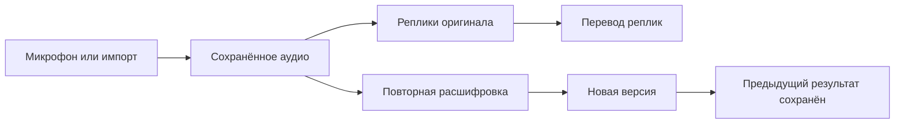

# Запись, расшифровка и перевод

Решение от 10 сентября 2026 года, после обратной связи о потере начала встречи. Изменения сделаны после TestFlight 20 и ещё не опубликованы.

## Основная схема

Аудиозапись — первичный материал. Расшифровка и перевод — сохраняемые результаты обработки, которые можно получить заново. Размер текстового поля, прокрутка и видимый фрагмент не участвуют в сохранении.

Для живого перевода обработка идёт параллельно записи. Ждать окончания встречи не нужно: аудио дописывается, оригинальные реплики сохраняются, готовые переводы добавляются к ним.

## Что изменилось

- Микрофонные записи сохраняются в WAV, 16 кГц, моно, PCM16 — около 38,4 МБ за 20 минут. Запись файла предшествует передаче очередной порции звука распознавателю. Заголовок обновляется при каждой порции, синхронизация выполняется примерно раз в секунду и при завершении. После ненормального завершения длина файла может быть восстановлена по его содержимому.
- Импортируемое аудио копируется без изменения содержимого в постоянное хранилище. Завершение расшифровки удаляет временное задание, а не оригинальную копию аудио.
- Обычная диктовка, голосовой перевод и диктовка с клавиатуры сохраняют аудио и исходный текст. Ожидание между нажатиями микрофона клавиатуры не записывается.
- У заметки появились воспроизведение, перемотка, экспорт аудио, повторная расшифровка и просмотр предыдущих версий.
- Повторная расшифровка не меняет текущий результат, пока новая попытка не завершится успешно. При успехе предыдущие оригинал и перевод остаются в истории. Ошибка новой попытки их не удаляет.
- Оригинальный текст фиксируется до завершающей обработки перевода. Ошибка перевода не удаляет его; непереведённые реплики остаются доступными в оригинале.
- Закрытие/прерывание записи сохраняет полученное аудио и черновик. Удаление заметки удаляет её версии и аудио, если его больше не использует другая заметка.

## Живой экран

Устоявшиеся реплики находятся в журнале с отметками времени. Изменяемая текущая речь отображается отдельно. Реплика считается устоявшейся, когда у распознавателя больше нет исправлений, которые могут затронуть её аудиодиапазон. Перевод тоже фиксируется после завершения обработки соответствующего оригинала.

Новая речь не уводит пользователя с ранее выбранной позиции. Возврат к текущей речи выполняется отдельной кнопкой. Размер текста по умолчанию увеличен до 24 pt, есть настройка. Проверка геометрии в XCTest подтверждает, что видимая историческая реплика не меняет позицию при изменениях черновика и добавлении новых реплик.

## Хранение и восстановление

Заметки записываются отдельными атомарными JSON-файлами. Старый notes.json сохраняется как совместимый индекс. Перед тем как разрешить восстановление из нового хранилища, все старые заметки копируются в него. Повреждённый старый файл без такой копии не перезаписывается молча.

Диктовка, клавиатура и импорт координируют операции файловой блокировкой. Черновики имеют номер обновления и признак завершения захвата: запоздалое обновление не может заменить завершённую или закрытую запись. Удалённая заметка не возвращается из позднего callback.

## Удаление языка

Действие теперь называется «Удалить язык». Оно удаляет язык из выбранных и освобождает его ненужные скачанные файлы. Общие файлы остаются, пока нужны другому выбранному языку или направлению перевода. Например, удаление FI → RU не удаляет EN → RU, если этот участок нужен DE → RU.

Записи и расшифровки не входят в каталог удаляемых загрузок. Неизвестные импортированные вручную пакеты не удаляются автоматически: они остаются под явным управлением хранилища.

## Microsoft Translator

В официальном описании Microsoft Translator есть история, отдельные режимы полного и разделённого экрана; справка описывает карточки перевода и сохранение избранных результатов. Для нашего случая полезен принцип отдельных читаемых реплик и доступной истории. Это анализ официального описания, а не сравнительное тестирование точности приложений. [App Store](https://apps.apple.com/us/app/microsoft-translator/id1018949559), [справка Microsoft для iOS](https://www.microsoft.com/en-us/translator/help/ios/).

В той же справке Microsoft указывает, что речевой перевод требует интернета и импорт внешних аудиофайлов не поддерживается. В Murmator приоритетом остаются локальная обработка и возможность повторно обработать сохранённый звук. [Справа Microsoft](https://www.microsoft.com/en-us/translator/help/ios/).

## Границы проверки

- Быстрый тест воспроизводит старую потерю истории при лимите 24 реплики: из 20 минут остаются последние две. Текущий код проходит остановку, сохранение и повторное чтение всей беседы. Версия приложения и режим из конкретного пользовательского отчёта пока не подтверждены, поэтому причину именно того случая нельзя считать установленной.
- Настоящий 20-минутный прогон использует повтор предоставленного короткого финского ролика на Mac. Это проверка сохранности и повторной обработки, не запись сегодняшней встречи и не оценка точности распознавания.
- Микрофон начинает работу после подготовки речевого стека, как и прежде. Обычная запись при прерывании приложения закрывается с сохранением полученного материала; непрерывная запись обычной диктовки при заблокированном экране здесь не заявляется.
- Для проверки на подключённом iPhone 15 Pro подготовлен отдельный Murmur Lab. Запуск ожидает подтверждения, что телефон свободен: переключение приложений может прервать текущую запись. TestFlight-приложение и его данные не заменялись.
